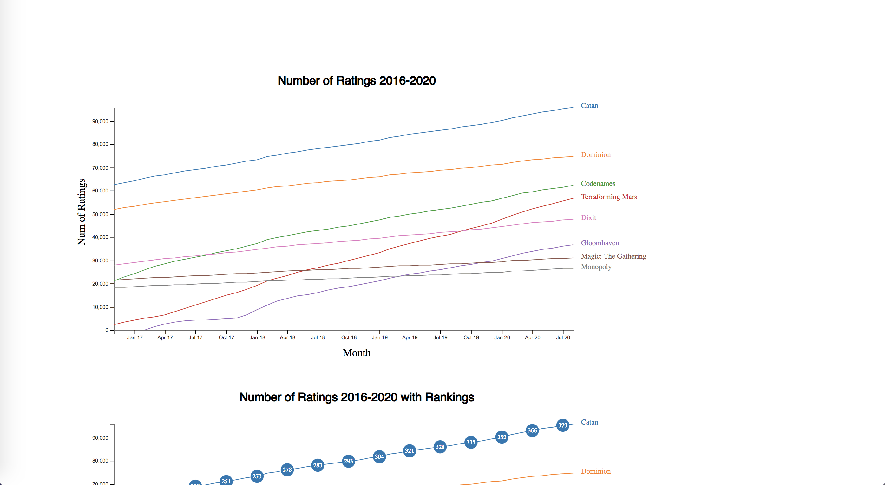
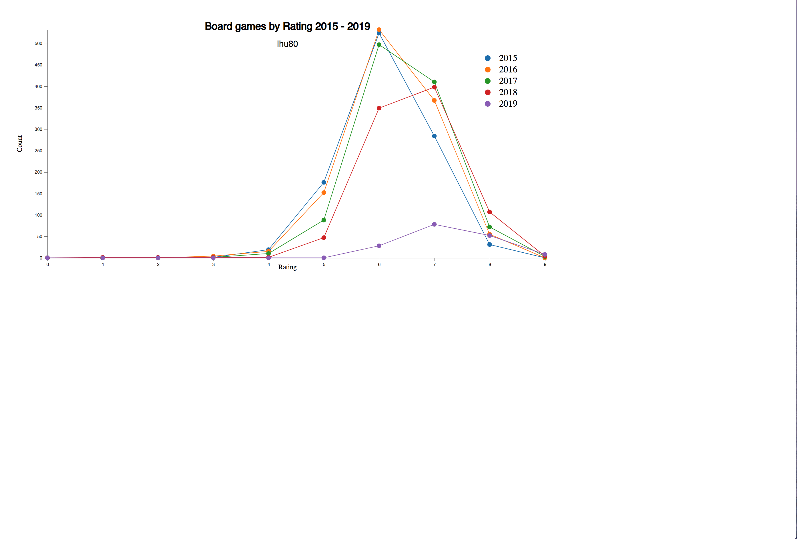

# Data-Visualization-by-D3.js

## Project 1 Force-directed Graph 
Description: the dataset for this question had inspiration from this post on [reddit
network visualization](https://www.reddit.com/r/boardgames/comments/9aphuw/a_network_visualization_of_the_board_game/) using boardgames in which the author calculates the similarity between board games based on categories and game mechanics where the edge value between each board game (node) is the total weighted similarity index.

## Project 2 Number of Ratings 2016-2020 with Rankings 
Description:   
● Horizontal axis label: Month. 
● Vertical axis label: Num of Ratings. Use a linear scale, Square root Scale and Log Scale. 

## Project 3 Interactive frequency polygon line chart
Description: This dataset(average-rating.csv) contains a list of games, their ratings and supporting information like numbers of users
who rated and year it was published. In the data sample below, each row under the header represents a
game name, year, average rating, and number of users who rated the game.

## Project 4 Choropleth maps 
Description: Use choropleth maps to examine the popularity of different board games across the world based on two data file ratings-by-country.csv and world_countries.json.  
● Game: the name of a game, e.g., Catan. 
● Country: a country in the world e.g., United States of America. 
● Number of Users: the number of users who have rated Game who are from Country. 
● Average Rating: the mean rating given to Game by users who are from Country. 

